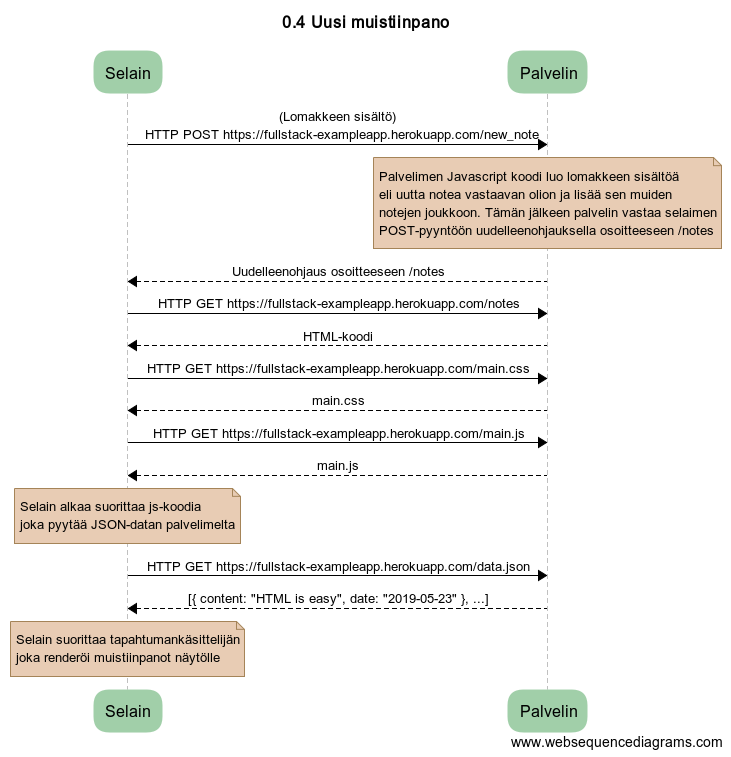

# Osa 0

## Luettu ja tutustuttu ensimmäisten tehtävien materiaaliin
* 0.1 HTML
* 0.2 CSS
* 0.3 HTML:n lomakkeet

## 0.4 Uusi muistiinpano

Kun lomakkeen nappia painetaan, selain lähettää lomakkeelle syötetyn datan eli uuden noten sisällön HTTP-POST pyyntönä palvelimelle osoitteeseen /new_note. Palvelimen JavaScript-koodi luo uutta notea vastaavan olion lähetetystä datasta ja lisää sen muistiinpanot sisältävään taulukkoon nimeltä notes. Palvelimen koodi vastaa tämän jälkeen HTTP-POST pyyntöön statuskoodilla 302. Kyseessä on uudelleenohjaus eli redirectaus pyyntö, joka tässä tapauksessa kohdistuu osoitteeseen /notes. Uudelleenohjauksen johdosta selain lataa uudelleen muistiinpanojen sivun, jolloin kaikki 4 sivun alkuperäisen latauksen yhteydessä tehtyä HTTP-GET pyyntöä toistuvat (notes, main.css, main.js, data.json). Kuitenkin välissä lisäämämme uusi note näkyy nyt muiden notejen joukossa, koska palvelin on lisänyt lähetetystä HTTP-POST pyynnön datasta muodostetetun note-olion muiden notejen taulukkoon ennen kuin redirectaus aiheuttaa muistiinpanojen uudelleen latauksen selaimeen.

## 0.5 Single Page App

Notes sivun lataaminen toimii hyvin samankaltaisesti sekä Single-Page-App että Non-Single-Page-App -versiossa. Erot sovellusten välillä tulevat selkeästi esiin vasta seuraavassa tehtävässä, kun käyttäjä lisää uuden muistiinpanon. Niinpä seqvenssikaavio on nyt hyvin samankaltainen materiaalissa esitetyn seqvenssikaavion kanssa. Ainoastaan HTML-dokumentin ja JS-koodin HTTP-GET pyynnön osoite on erilainen, eli selain pyytää niistä Single-Page-App versioita.

## 0.6 Uusi muistiinpano (Single Page App)

Seqvenssikaavio on nyt huomattavasti lyhyempi kuin tehtävässä 0.4. Käyttäjän painaessa save-nappia selaimen JS-koodi luo ensin uuden note olion, lisää sen muiden notejen joukkoon ja piirtää notet uudestaan ruudulle. Vasta tämän jälkeen selain lähettää noten palvelimelle HTTPS-POST pyynnöllä. Koska muistiinpanot on jo päivitetty selaimessa, redirectaukselle ei ole enää tarvetta ja selaimen ei tarvitse tehdä nejää HTTP-GET pyyntyä uudestaan, kuten tehtävän 0.4 tapauksessa.
